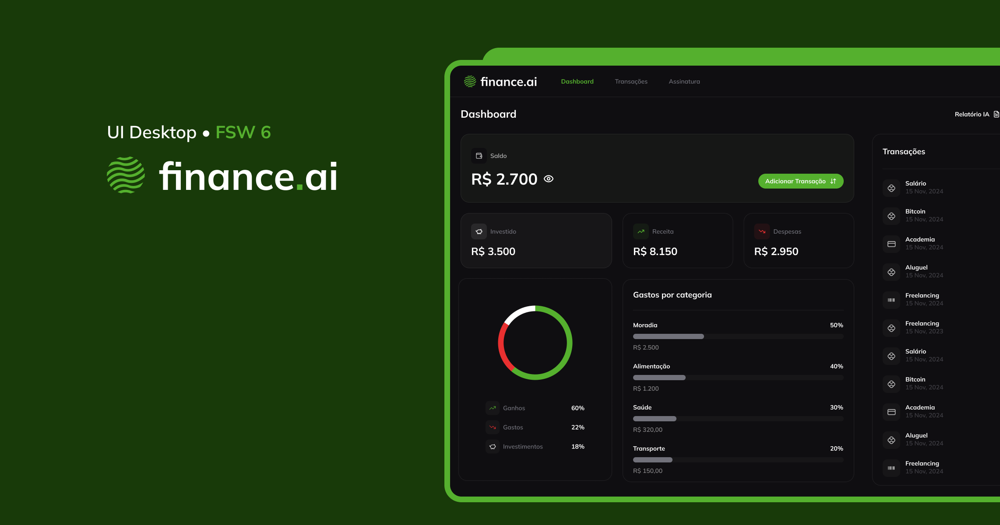

Aplicação web de gestão financeira com integração ChatGPT(OpenAI)



### Features

- [x] Autenticação segura com Clerk
- [x] Validação de formulários com Zod e React-Hook-Form
- [x] Manipulação dinâmica de tabelas utilizando o Shadcn UI
- [x] Planos de assinatura com integração do Stripe
- [x] Relatórios inteligentes, gerados usando a API da OpenAI (ChatGPT)
- [x] Registro de transações categorizadas por tipo e método de pagamento
- [x] Visualização de dados financeiros em gráficos interativos com Recharts
- [ ] Responsividade para mobile

### Pré-requisitos

```
Antes de começar, você vai precisar ter instalado em sua máquina as seguintes ferramentas:
[Git](https://git-scm.com), [Node.js](https://nodejs.org/en/).
Além disto é bom ter um editor para trabalhar com o código como [VSCode](https://code.visualstudio.com/)

### 🎲 Rodando o Front End

bash
# Clone o repositório
$ git clone https://github.com/IgorSaturno/finance-ai.git

# Acesse a pasta do projeto no terminal/cmd
$ cd finance-ai

# Instale as dependências
$ npm install

# Execute a aplicação em modo desenvolvedor
$ npm run dev

### 🎲 Rodando o Back End (servidor)

Crie um arquivo .env e preencha as seguintes variáveis de ambiente:

NEXT_PUBLIC_CLERK_PUBLISHABLE_KEY=
CLERK_SECRET_KEY=
DATABASE_URL=

STRIPE_PREMIUM_PLAN_PRICE_ID=
STRIPE_SECRET_KEY=
NEXT_PUBLIC_STRIPE_PUBLISHABLE_KEY=
STRIPE_WEBHOOK_SECRET=
NEXT_PUBLIC_STRIPE_CUSTOMER_PORTAL_URL=
OPENAI_API_KEY=
APP_URL=

Execute as migrações:
$ npx prisma migrate dev

Para executar localmente pode se utilizar o docker
$ docker compose up
```

### 🛠 Tecnologias

As seguintes ferramentas foram usadas na construção do projeto:

- [NextJS](https://nextjs.org/)
- [React](https://react.dev/)
- [TailwindCSS](https://tailwindcss.com/)
- [Stripe](https://stripe.com/br)
- [Clerk](https://clerk.com/)
- [ShadcnUI](https://ui.shadcn.com/)
- [Date-fns](https://date-fns.org/)
- [Recharts](https://recharts.org/en-US/)
- [Zod](https://zod.dev/)
- [React-Hook-Form](https://www.react-hook-form.com/)
- [OpenAI](https://openai.com/api/)
- [TypeScript](https://www.typescriptlang.org/)

## Deploy

- Plataforma Recomendada: [Vercel](https://vercel.com/)
- Configure as variáveis de ambiente no painel da Vercel.
